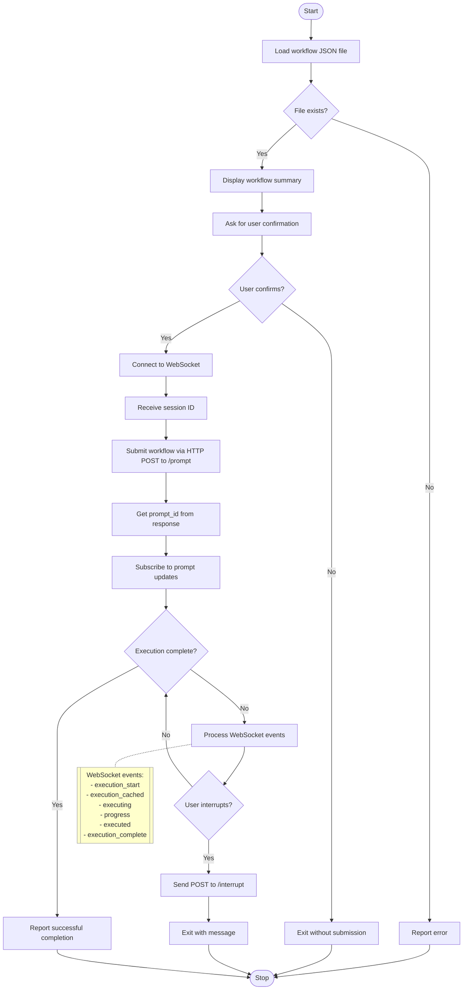
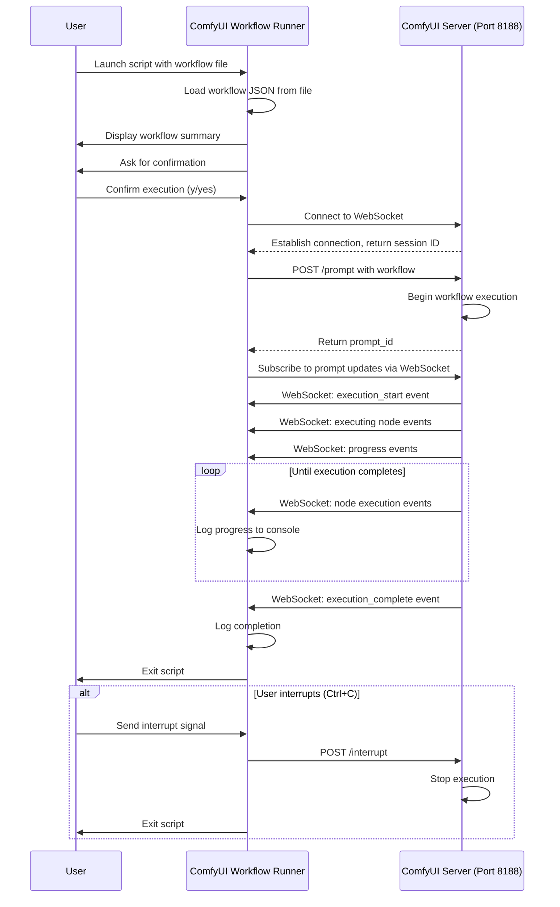
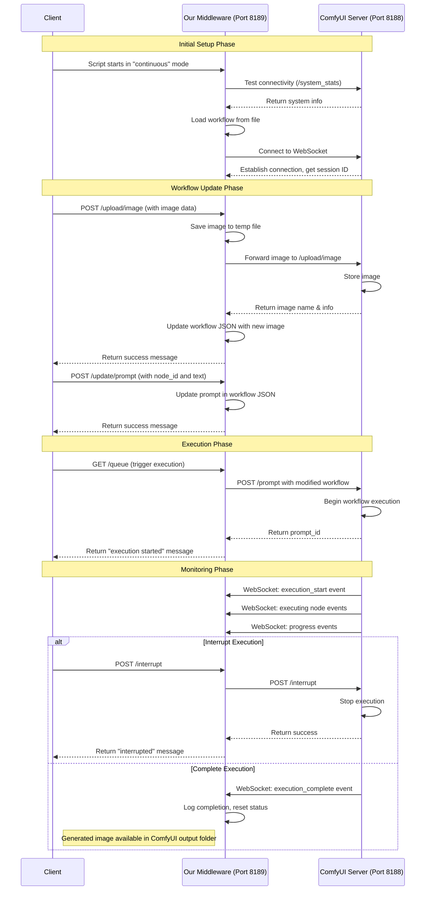
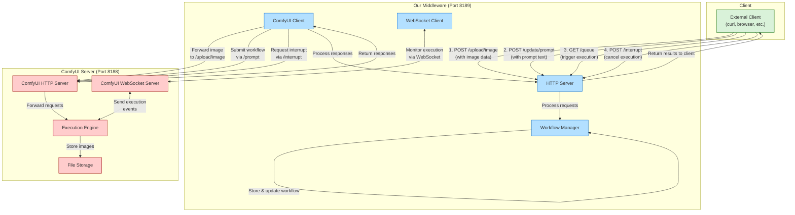

# README

## ComfyUI Workflow Executor

### Example for API Usage

A Python test script for executing ComfyUI workflows via the API with real-time monitoring.

### Overview

This script allows you to:

1. Load and execute a ComfyUI workflow from JSON files, exported from ComfyUI (after __dev__ mode is enabled you can select `export _Export(API)`) and store the json file in the root directory as `workflow_api.json`.
2. Monitor execution progress in real-time via WebSocket
3. Interrupt workflow execution when needed

Notes:

1. There is an example [workflow.json](workflow.json) present here. You an load that in your ComfyUI and check it out. It's a basic text to image workflow that uses SDXL4.0 checkpoint (There are notes in the workflow from where you can download the checkpoints in the right location)
2. The respective exported [workflow_api.json](workflow_api.json) for convenience. But better you export it and do customization if needed.

### Requirements

1. Python 3.8+
2. ComfyUI server running (default: localhost:8000)
3. Required Python packages:
   1. websockets
   2. requests
   3. asyncio

### Installation

> Tested on MacOS

1. Clone the repo
2. Load the wokflow in Comfy UI (install dependencies following the workflow notes)
3. export the workflow api and rename it as `workflow.json` and store it here in the root of the repo.
4. Then:

```bash
python3 -m venv venv
python3 -m pip install -r requirements.txt
python3 comfyui-workflow-runner.py
```

### Understanding

```python
curr_workflow = "workflow_api.json" # Is where you supply the workflow file
RUN_MODE = "continuous"  # Options: "single_shot" or "continuous"
AUTO_EXECUTE_ON_UPLOAD = False  # To control auto-execution on image upload
```

### Example Output

> Ignore the first few frames where I struggle with the correct imports and installations ... 😵


### What is the script doing? 

> If mermaid is not visisble in your markdown renderer, checkout the [png](_assets/script_test_api_flow.png) /[svg](_assets/script_test_api_flow.svg) / [UML](https://www.planttext.com?text=RLFBRkCm3BpxAtXC3yNUwyDsiUtsWSKsg5FqM3Wo7GknHK6ay_ZxfMmb2f1UR9ap7758-fwb3Z8EVI5MUeJVDBJ7ZnVufB1jUzfhm4cW7YeJh9UYcFZ5tL-g6zYVIA_LspzeROzbOLjO_D4JuC6oyCyRa0uTB8x8DmN0tODbtzV7dClZCDJXM4Rm5s-XfG0ZOm13hhLXgCMIYsXK_hW0hhHLGAjrQ0I4u1FN5PajIZb3xsZGxX0OcLKHNXuIK8thmKekQ6ThU5wjbh1ygrPHwOSFDFYJpXCAp84lsq2h9mZ8dXnZ5cJjrXfZyao5qJUr8C-CwR7lOfSMZmSqOxIejWRVew3QiWmBHxCd5Lm6CbfrjWIuGoT93S2H80IxwIG506wr_qduQnxPTuYfJOVDDUGs5p5ri567V4NxBZEA9Xy9HDTC1QRFz3eFqph144P_lIh9V1K5pgCuqylCU3p4yLdfOD0owmrcZ8LyhiEsHJfDpS-pqENm54HtqSH6jsD_caRQFUmPyqZoZJJ69DsVQQScvdJD9VyahdLJA8kPC1LshsVzzVu3)
> 



---

### MODE Architechture breakdowns

SINGLE SHOT MODE



---

CONTINUE MODE



CONTINIOUS MODE MIDDLE WARE ARCHITECHTURE



### Features

1. Interactive Confirmation: Asks before executing to avoid accidental runs
2. Real-time Monitoring: Shows which nodes are executing and progress percentage
3. Graceful Cancellation: Press Ctrl+C to cancel execution
4. Automatic Session Handling: Uses WebSocket session ID for proper workflow tracking

---

### What are the API's available to us and have been implemented here?

[Check the API docs here](docs/COMFYUI_API.md)

---

### License

[MIT](LICENSE)
