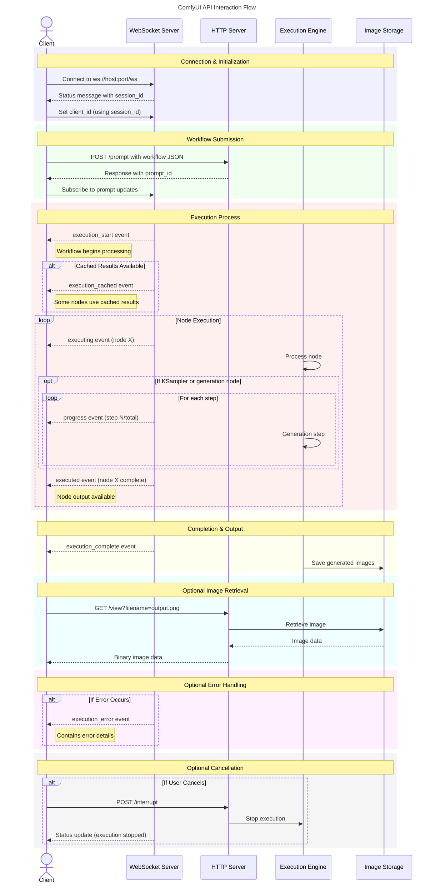

# Comfy UI API end-points

Sourced and made digestible after extensive internet searches, forum browsing, issue trackers, and insufficient documentation

---

## HTTP Endpoints

| Endpoint | Method | Purpose | Example Response | Example Test Command | Implementation Status |
|----------|--------|---------|-----------------|--------------|----------------------|
| `/prompt` | POST | Submit workflow | `{"prompt_id": "6f962d0e-40d9-45e8-b378-7247258cadde", "number": 1, "node_errors": {}}` | Header: `http://127.0.0.1:8000/prompt`  Body: `{"prompt": {…},"client_id":"df1465dc01f6446aa65e117c151c44d0"}` | ✅ Implemented |
| `/queue` | GET | Get current queue status | `{"queue_running": [{"prompt_id": "6f962d0e-40d9-45e8-b378-7247258cadde", "number": 1}], "queue_pending": [{"prompt_id": "7a973e1f-58b9-42d6-b3c5-e7adef5632dc", "number": 2}]}` | `http GET http://127.0.0.1:8000/queue` | 🔶 Testing |
| `/history` | GET | Get execution history | `{"6f962d0e-40d9-45e8-b378-7247258cadde": {"prompt": {...}, "outputs": {...}, "status": "complete"}}` | `http GET http://127.0.0.1:8000/history` | ❌ Not implemented |
| `/history/{prompt_id}` | GET | Get specific execution | `{"prompt": {...}, "outputs": {...}, "status": "complete"}` | `http GET http://127.0.0.1:8000/history/6f962d0e-40d9-45e8-b378-7247258cadde` | ❌ Not implemented |
| `/view` | GET | View generated images | Binary image data (PNG/JPEG) | `http GET http://127.0.0.1:8000/view?filename=ComfyUI_00042_.png --output image.png` | ❌ Not implemented |
| `/upload/image` | POST | Upload input image | `{"name": "uploaded_image.png", "subfolder": "", "type": "input"}` | `http -f POST http://127.0.0.1:8000/upload/image overwrite=true image@/path/to/image.png` | ❌ Not implemented |
| `/upload/mask` | POST | Upload mask image | `{"name": "uploaded_mask.png", "subfolder": "", "type": "mask"}` | `http -f POST http://127.0.0.1:8000/upload/mask overwrite=true image@/path/to/mask.png` | ❌ Not implemented |
| `/object_info` | GET | Get node information | `{"CheckpointLoaderSimple": {"input": {...}, "output": {...}}, "KSampler": {...}}` (Large JSON with all node types) | `http GET http://127.0.0.1:8000/object_info` | ❌ Not implemented |
| `/system_stats` | GET | Get system statistics | `{"cuda": {"gpu": "NVIDIA GeForce RTX 3080", "vram_total": 10240, "vram_free": 8192}, "system": {"cpu_percent": 25.6, "ram_total": 32768, "ram_free": 16384}}` | `http GET http://127.0.0.1:8000/system_stats` | ❌ Not implemented |
| `/extensions` | GET | List installed extensions | `{"extensions": ["ComfyUI-Manager", "ComfyUI-Impact-Pack"]}` | `http GET http://127.0.0.1:8000/extensions` | ❌ Not implemented |
| `/interrupt` | POST | Stop execution | `{"success": true}` | `http POST http://127.0.0.1:8000/interrupt` | ✅ Implemented |

## WebSocket Messages

| Message Type | Direction | Purpose | Example Message | Implementation Status |
|--------------|-----------|---------|----------------|----------------------|
| `status` | Server→Client | System status | `{"type": "status", "data": {"status": {"exec_info": {"queue_remaining": 1}}, "sid": "4921363473c149bfaab99efa190033b3"}}` | ✅ Used to get session ID |
| `execution_start` | Server→Client | Execution begins | `{"type": "execution_start", "data": {"prompt_id": "6f962d0e-40d9-45e8-b378-7247258cadde"}}` | ✅ Monitored in script |
| `execution_cached` | Server→Client | Results from cache | `{"type": "execution_cached", "data": {"prompt_id": "6f962d0e-40d9-45e8-b378-7247258cadde", "nodes": ["1", "2", "3"]}}` | ✅ Monitored in script |
| `executing` | Server→Client | Current node | `{"type": "executing", "data": {"node": "5", "prompt_id": "6f962d0e-40d9-45e8-b378-7247258cadde"}}` | ✅ Monitored and displayed |
| `progress` | Server→Client | Generation progress | `{"type": "progress", "data": {"value": 10, "max": 20, "prompt_id": "6f962d0e-40d9-45e8-b378-7247258cadde"}}` | ✅ Monitored with percentage |
| `executed` | Server→Client | Node completion | `{"type": "executed", "data": {"node": "5", "output": {"images": [...]}, "prompt_id": "6f962d0e-40d9-45e8-b378-7247258cadde"}}` | ✅ Monitored in script |
| `execution_error` | Server→Client | Error reporting | `{"type": "execution_error", "data": {"node": "5", "exception_message": "CUDA out of memory", "prompt_id": "6f962d0e-40d9-45e8-b378-7247258cadde"}}` | ✅ Basic error handling |
| `execution_complete` | Server→Client | Execution finished | `{"type": "execution_complete", "data": {"prompt_id": "6f962d0e-40d9-45e8-b378-7247258cadde"}}` | ✅ Used to detect completion |
| Client message | Client→Server | Set client ID | `{"client_id": "test_client"}` | ✅ Used for connection tracking |
| Client message | Client→Server | Subscribe to updates | `{"op": "subscribe_to_prompt", "data": {"prompt_id": "6f962d0e-40d9-45e8-b378-7247258cadde"}}` | ✅ Used for monitoring |

---

## Execution Flow Diagram

> If mermaid is not visisble in your markdown renderer, checkout the [png](../_assets/comfyui_api_interaction.png) /[svg](../_assets/comfyui_api_interaction.svg) / [UML](https://www.planttext.com?text=VLN1Rjim3BthAuWUXkRGvHuWMxiWRRCDJL2to6w5R3EEK5aI93bPz_MZ9DjnchG-s9RrfFVuHDBNpdFhcreoBxn4cEbwy_QyW9lL0XRAe-M55rh1hTHxncYWBSoaGEMPeOMY48Oh3nThp3DTlAA73EqExGLm1-li67J_zBGQpeVnCMB-5uic4ivL9HH6M7fb9VSyvmxXOb7p2Y4ZBVICaFQTiUcKGb0Aa-el58FmWalnZySFqobBwk7g6ycRT63m6lPkCXvljVCJewqVxnrRPt15kBHYGYJSDmvgT2xmxuNVWgC1RVmYodSRPsH54R_G75msJgXgW1v5gMjjNpVaB6HDNeiuTomnE3I1rJ9xWh6nkZO-qUwxXJ-pvGEBlWwLFg8pMhbMOrfuHcAJkyAA74FqxUwD8PlHHNM7mrXPNP3qeEsT9zXXNc8Y0Uv2QYZj4QoejeJeOyoHZj45eh0NsK7v93tCUB75CaXkf7Tmi-D2ybmY0xe-P2lIgaGNa4FAJDT87qfqq909BTOc1eQgPAookZ7mG9X1cB-rDf_GqW56FhWCUyEVKSIcx0oUfhT9xrP0HKYyQN9tiO5V6Q-DH0jKI1KgAh18tMF39Ka7t180IJauZwQVEgEE3Ariu6l51JmyZBtsN8wE5fvAlJieEA897WsV7xlI7K9d2XGwnETnT78iqMtTUDDuuFqnn-E8PHlNfR9T9jHd-TRnj3bmYAtj1PG6V8UTnoHJXAwHCdjfmXPSGkeaZ-Yjm1sDpnJVtPngRoTm_tqZ92fUupJ5yDLG2gVI6v2sUs6YO-tt64FQBr66PdPQjp-4ulOjBKsG8xLpQoafxhagPKX64XiAY98gJIoBeh7kyxh1Y3nVDjGBFGybca0bqaYw_e1w6JEk2fIoxwYjY6T7MPtcaeZpRKo4lufjJEBl_EiIalmo1xddOccxS6fKSDbZAO6rCKYTDGg-fZlzrlu3)

---

## Credits & Sources

> Descending order of discovery

1. Official ComfyUI Github:[ISSUE:2110](https://github.com/comfyanonymous/ComfyUI/issues/2110)
2. Official ComfyUI Github: [ComfyUI's script_examples](https://github.com/comfyanonymous/ComfyUI/tree/master/script_examples)
3. Official ComfyUI docs: [docs.comfy.org/essentials/comms_routes](https://docs.comfy.org/essentials/comms_routes)
4. Official ComfyUI docs: [docs.comfy.org/essentials/comfyui-server/comms_messages#built-in-message-types](https://docs.comfy.org/essentials/comfyui-server/comms_messages#built-in-message-types)
5.  Medium Article: [ComfyUI : WebSockets API : Part 1](https://medium.com/@yushantripleseven/comfyui-websockets-api-part-2-0ab988acfd97)
6.  Medium Article: [ComfyUI : WebSockets API : Part 2](https://medium.com/@yushantripleseven/comfyui-websockets-api-part-2-0ab988acfd97)
7. Medium Article: [ComfyUI : WebSockets API : Part 3](https://medium.com/@yushantripleseven/comfyui-websockets-api-part-2-0ab988acfd97)